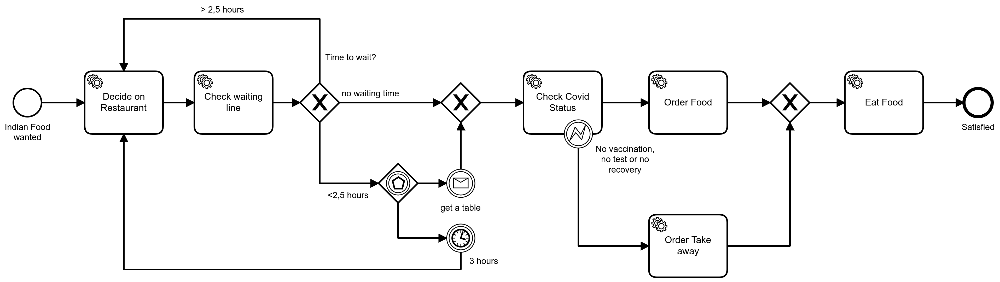

# Indian-Restaurant-Process

This is the process model I showed during my [talk](https://www.youtube.com/watch?v=OSuEFufhSvg) at the [*WTF is cloud native conference*](https://www.cloud-native-conf.wtf/). 

It's implemented in [Camunda Cloud](https://docs.camunda.io/docs/components/concepts/what-is-camunda-cloud/). In this repository, you can reference the BPMN Diagram I created. In the [Workers](https://github.com/Nlea/Indian-Restaurant-Process/tree/main/Workers) folder, you'll find the Node Workers that I used.




In order to run the project, you'll need to create a [Camunda Cloud Account](https://console.cloud.camunda.io/) and set up a [cluster](https://docs.camunda.io/docs/components/cloud-console/manage-clusters/create-cluster/) in the Camunda [Cloud console](https://docs.camunda.io/docs/components/cloud-console/introduction/). 

## Deploying the process 

To run the project, deploy the [BPMN diagram](https://github.com/Nlea/Indian-Restaurant-Process/blob/main/Indian-Food-Restaurant-Process.bpmn) from this repository to Camunda Cloud. You can do so by using the Cloud Modeler, [importing](https://docs.camunda.io/docs/components/modeler/cloud-modeler/import-diagram/) the BPMN file and [deploying](https://docs.camunda.io/docs/components/modeler/cloud-modeler/save-and-deploy/) it from there.

There are other options, too:

- You can use the [Camunda Desktop Modeler](https://camunda.com/download/modeler/) 
- You can use a [client library](https://docs.camunda.io/docs/apis-clients/java-client-examples/process-deploy/)
- You can [build your own client](https://docs.camunda.io/docs/apis-clients/build-your-own-client/) to deploy a process  

❗ If you use one of the alternative options listed above, you'll need to set up [client connection credentials](https://docs.camunda.io/docs/guides/getting-started/setup-client-connection-credentials/).

## Start a process instance

You can [start an instance](https://docs.camunda.io/docs/components/modeler/cloud-modeler/start-instance/) of your process using the Cloud Modeler. 

There are other options, too: 

- You can use the [Camunda Desktop Modeler](https://camunda.com/download/modeler/) 
- You can use a [client library](https://docs.camunda.io/docs/apis-clients/java-client-examples/process-instance-create/)
- You can [build your own client](https://docs.camunda.io/docs/apis-clients/build-your-own-client/#authentication-via-oauth)  

❗ If you use one of the alternative options listed above, you'll need to set up [client connection credentials](https://docs.camunda.io/docs/guides/getting-started/setup-client-connection-credentials/)


👀 Once you've started a process instance, you can get an overview of its state in [Operate](https://docs.camunda.io/docs/components/operate/index/)


## Running the Job workers

In order to change the state of a process, you'll need to run the [job workers](https://github.com/Nlea/Indian-Restaurant-Process/tree/main/Workers) from this repository and connect them to your Camunda Cloud Cluster. 

1. [Set up client connection credentials](https://docs.camunda.io/docs/guides/getting-started/setup-client-connection-credentials/)
2. Create a .env file in the workers directory and paste in your credentials  
```
ZEEBE_ADDRESS='xxxxxxxxx-xxxx-xxxx-xxxx-xxxxxxxxxxxx.xxx-x.zeebe.camunda.io:xxx'
ZEEBE_CLIENT_ID='xxxxxxxxxxxxxxxxxxxxxxxxxxxxxxx'
ZEEBE_CLIENT_SECRET='xxxxxxxxxxxxxxxxxxxxxxxxxxxxxxxxxxxxxxxxxxxxxxxxxxxxxxxxxxxxxx'
ZEEBE_AUTHORIZATION_SERVER_URL='https://login.cloud.camunda.io/oauth/token'
```
3. Install all the needed packages in order to run the Node clients: 

- The workers are written in JavaScript, so please make sure you have [node.js and npm](https://docs.npmjs.com/downloading-and-installing-node-js-and-npm) installed
- The workers also use [Typescript](https://www.npmjs.com/package/ts-node#overview) so make sure you have it installed
- In order to read the credentials from the .env file, you'll need the [Dotenv package](https://www.npmjs.com/package/dotenv): ```npm install dotenv```   
- In order to connect to Camunda Cloud, the Workers use the [JS Client library](https://docs.camunda.io/docs/apis-clients/community-clients/javascript/) ```npm install zeebe-node ``` 

4. Run the workers: Naviage to the folder of the workers and start them by using ```ts-node src/WORKERSNAME.ts ``` 
5. 👀 Observe the console of the workers and the state of the process in Operate
